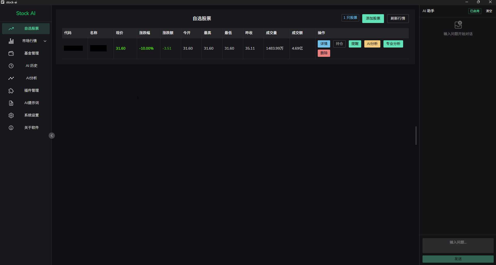
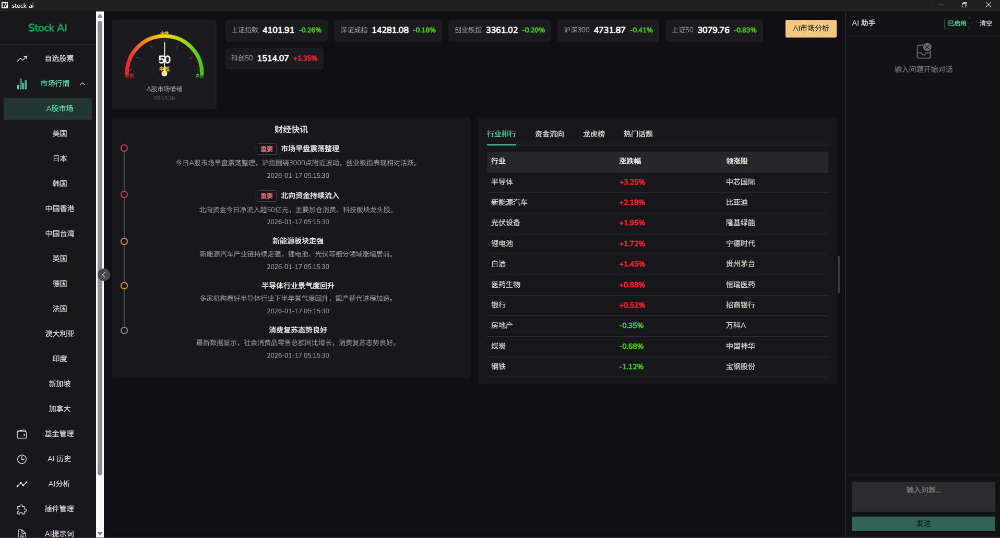
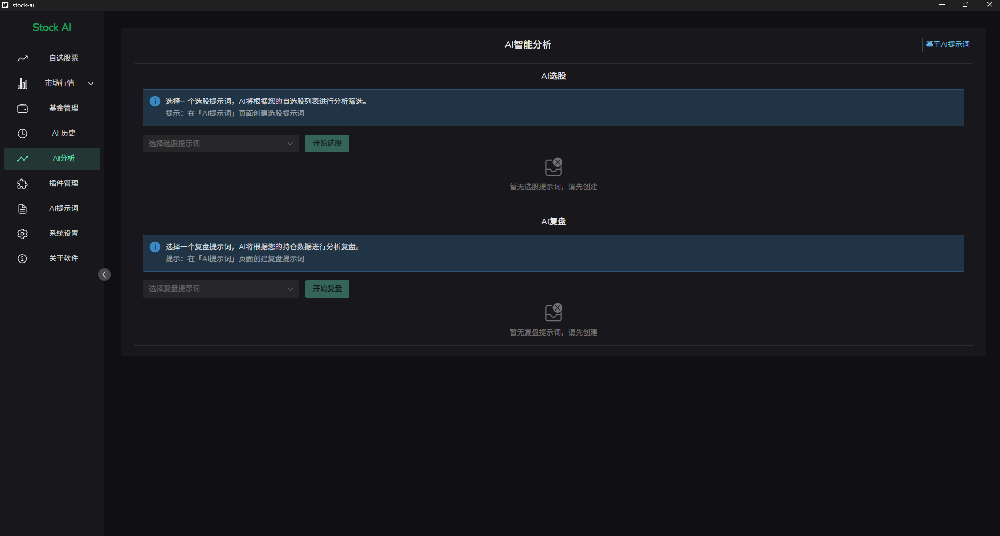
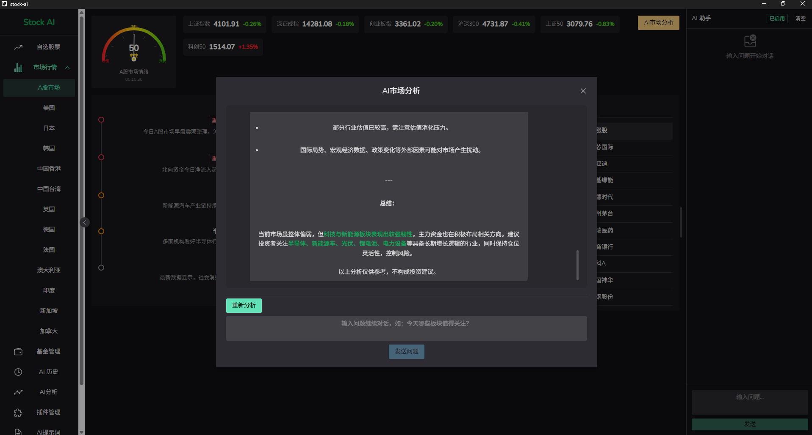
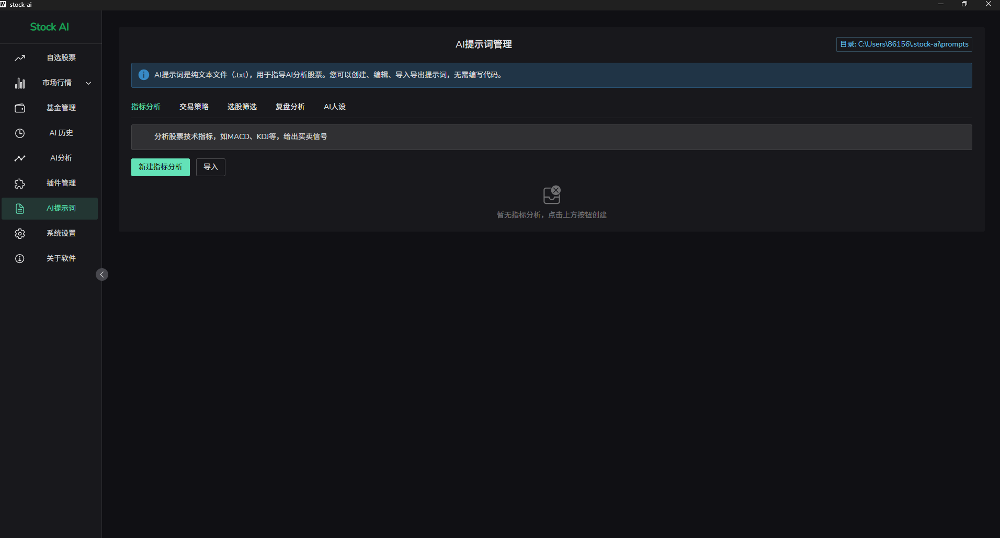
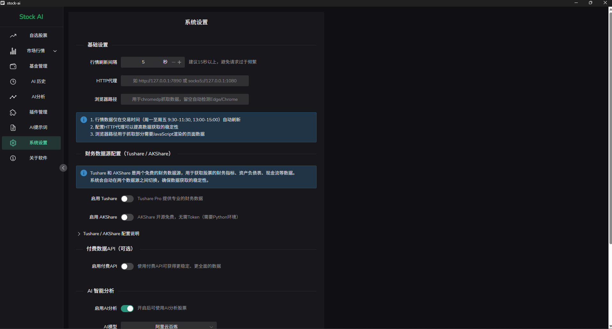

# Stock AI

一个开源的股票数据展示与 AI 分析工具，仅供学习研究使用。

## 下载安装

### 直接下载（推荐）

无需安装任何开发环境，下载即可使用：

| 版本 | 平台 | 下载链接 |
|------|------|----------|
| v1.0.0 | Windows | [Stock-AI-v1.0.0-windows.exe](releases/Stock-AI-v1.0.0-windows.exe) |

> **使用说明**：下载后双击运行即可，首次运行需要同意免责声明。如需使用 AI 功能，请在「系统设置」中配置您自己的 AI API Key。

### 从源码构建

如果您是开发者，也可以从源码构建，详见下方 [开发指南](#开发指南)。

## 软件截图

### 自选股票


### 市场行情


### AI 分析


### AI 总结


### 自定义提示词


### 系统设置


## 免责声明

> **重要提示：请在使用前仔细阅读**

1. **非投资建议**：本软件提供的所有信息、数据、分析结果仅供学习研究和参考，不构成任何投资建议、投资咨询或证券推荐。
2. **无资质声明**：本软件及其开发者不具备证券投资咨询业务资格，不提供任何形式的证券投资咨询服务。
3. **AI 生成内容**：软件中的 AI 分析结果由用户自行配置的第三方 AI 服务生成，可能存在错误或偏差，仅供参考，不应作为投资决策的依据。
4. **数据来源**：本软件数据来源于公开渠道，不保证数据的准确性、完整性和及时性。
5. **投资风险**：**股市有风险，投资需谨慎。** 任何投资决策应基于您自己的独立判断，并建议咨询专业的持牌投资顾问。
6. **免责条款**：使用本软件造成的任何直接或间接损失，开发者不承担任何责任。

## 功能特性

- **实时行情**：支持 A 股、港股、美股等多市场实时行情
- **自选管理**：添加自选股票和基金，查看自选股票的实时行情
- **自定义提示词**：自定义股票、基金的提示词，提高自选股票的识别准确度
- **系统设置**：配置 AI 功能、自定义提示词、数据更新频率等
- **市场概览**：主要指数、行业排行、资金流向、龙虎榜
- **财经快讯**：财联社实时快讯推送
- **研报公告**：个股研报和公告查询
- **AI 分析**：接入 DeepSeek/OpenAI/Ollama 等 AI 模型（需用户自行配置 API Key）
- **本地存储**：SQLite 本地数据库，数据安全不上传

## 技术栈

- **后端**：Go 1.23 + Wails v2
- **前端**：Vue 3 + Naive UI + ECharts
- **数据库**：SQLite (WAL 模式)
- **数据来源**：新浪财经 / 腾讯财经 / 东方财富 / 财联社等公开数据源

## 开发指南

### 环境要求

- Go 1.23+
- Node.js 18+
- Wails CLI v2

### 开发模式

```bash
# 安装 Wails CLI
go install github.com/wailsapp/wails/v2/cmd/wails@latest

# 进入项目目录
cd stock-ai

# 运行开发模式
wails dev
```

### 构建发布

```bash
# 构建 Windows 可执行文件
wails build
```

构建产物位于 `build/bin/stock-ai.exe`

## 配置说明

### AI 配置

本软件不内置 AI 服务，需要用户自行配置：

1. 打开软件，进入「系统设置」
2. 启用 AI 功能
3. 选择 AI 提供商（DeepSeek/OpenAI/Ollama 等）
4. 填入您自己的 API Key
5. 保存配置

## 项目结构

```
stock-ai/
├── app.go              # 主应用逻辑
├── main.go             # 入口文件
├── backend/            # 后端模块
│   ├── data/           # 数据获取
│   ├── models/         # 数据模型
│   ├── plugin/         # 插件系统
│   └── prompt/         # AI 提示词
├── frontend/           # 前端代码
│   └── src/
│       ├── views/      # 页面组件
│       └── components/ # 通用组件
└── build/              # 构建配置
```

## 开源协议

本项目基于 [MIT License](LICENSE) 开源。

```
MIT License

Copyright (c) 2025 Stock AI

Permission is hereby granted, free of charge, to any person obtaining a copy
of this software and associated documentation files (the "Software"), to deal
in the Software without restriction, including without limitation the rights
to use, copy, modify, merge, publish, distribute, sublicense, and/or sell
copies of the Software, and to permit persons to whom the Software is
furnished to do so, subject to the following conditions:

The above copyright notice and this permission notice shall be included in all
copies or substantial portions of the Software.

THE SOFTWARE IS PROVIDED "AS IS", WITHOUT WARRANTY OF ANY KIND, EXPRESS OR
IMPLIED, INCLUDING BUT NOT LIMITED TO THE WARRANTIES OF MERCHANTABILITY,
FITNESS FOR A PARTICULAR PURPOSE AND NONINFRINGEMENT. IN NO EVENT SHALL THE
AUTHORS OR COPYRIGHT HOLDERS BE LIABLE FOR ANY CLAIM, DAMAGES OR OTHER
LIABILITY, WHETHER IN AN ACTION OF CONTRACT, TORT OR OTHERWISE, ARISING FROM,
OUT OF OR IN CONNECTION WITH THE SOFTWARE OR THE USE OR OTHER DEALINGS IN THE
SOFTWARE.
```

## 联系方式

- **QQ**：[3946808002]

### 技术支持

如需软件定制开发或技术支持，欢迎联系。

服务范围：
- 功能定制开发
- 私有化部署
- 数据接口对接
- 技术咨询

> 注：仅提供技术开发服务，不提供任何投资咨询服务。

## 致谢

- [Wails](https://wails.io/) - Go + Web 桌面应用框架
- [Vue.js](https://vuejs.org/) - 前端框架
- [Naive UI](https://www.naiveui.com/) - Vue 3 组件库
- [ECharts](https://echarts.apache.org/) - 图表库
- [AKShare](https://akshare.akfamily.xyz/) - 金融数据接口参考

---

**再次提醒：本软件仅供学习研究使用，不构成任何投资建议。投资有风险，入市需谨慎。**
